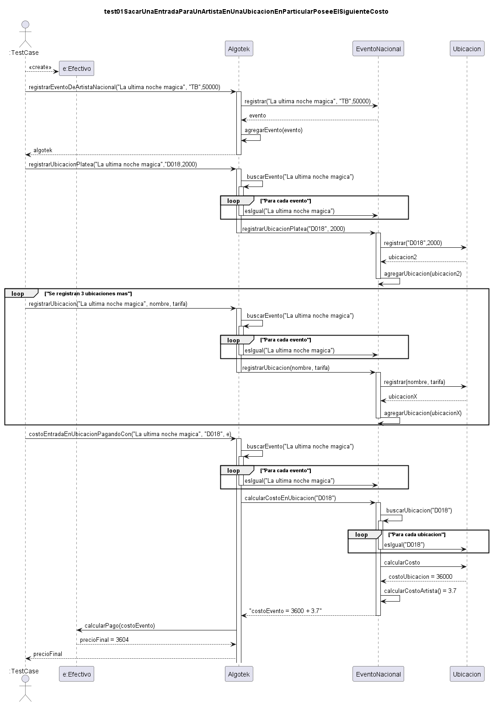
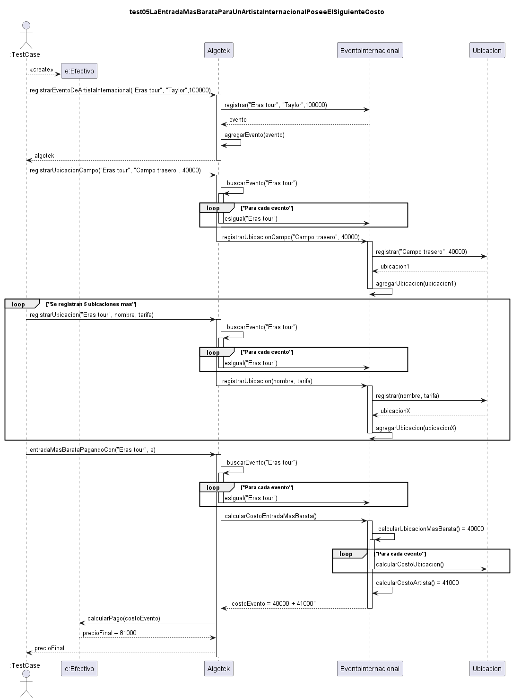

# **Trabajo Práctico 1 — Smalltalk**

## [7541/9515] Algoritmos y Programación III

### Segundo cuatrimestre de 2021

| Alumno:           | Vallejos, Matias    |
|-------------------|---------------------|
| Número de padrón: | 107924              |
| Email:            | mvallejos@fi.uba.ar |

#### 1. Introducción

El trabajo práctico consiste en desarrollar una aplicación capaz de manejar entradas para conciertos de artistas tanto nacionales como internacionales, esto se logra utilizando los conceptos del paradigma orientado a objetos vistos en clase.

#### 2. Supuestos

* Pagar con efectivo no ofrecerá ningún descuento
* No se puede aumentar la capacidad de lugares de una UbicacionViP una vez creada
* Puede haber tarifas de artistas que sean 0, en este caso se considerara como que es un evento gratis.
* Puede haber tarifas de ubicaciones que sean 0, en este caso se considerara que el precio de la ubicación es gratis.

#### 3. Detalles de implementación

1. Pilares de la programación orientada a objetos utilizados
   
   Con el objetivo de que el código sea lo más orientado a objetos posibles se usaron los siguientes pilares:
   1. **Encapsulamiento**: Se usó por ejemplo en la clase `Evento` el setter `registrarDeArtistaConTarifaArtista` y en la clase `Ubicacion` el setter `registrarConTarifa` logrando así ocultar el estado interno de la clase y haciendo que solo se pueda acceder y modificar a través de los métodos de la clase, respetando el encapsulamiento, la ventaja de hacer esto es que podemos cambiar la implementación de la clase sin afectar al código que la usa haciendo así el código más **robusto y fácil de mantener**.
   2. **Polimorfismo**: Se usó por ejemplo en las clases `EventoNacional`, `EventoInternacional`, `UbicacionViP`, `UbicacionPlateaPreferencial`, `UbicacionCampo` esto se logra mediante que los eventos a pesar de ser diferentes clases puedan entender el mismo mensaje ej. `calcularCostoEntradaEnUbicacion` y las ubicaciones `calcularCosto`, de esta forma logramos también **ocultar detalles de implementación,** ya que quien invoca a estos objetos no tiene conocimiento de qué evento o ubicación está usando, la ventaja de hacer esto es que podemos **reducir el acoplamiento, aumentar la reutilización y que el código sea más fácil de leer y mantener**.
   3. **Herencia**: Se usó por ejemplo en las clases `EventoNacional`, `EventoInternacional` las cuales heredan de `Evento` y también en `UbicacionViP`, `UbicacionPlateaPreferencial`, `UbicacionCampo` las cuales heredan de `Ubicacion` una de las ventajas de haber usado herencia es que podemos usar un comportamiento de la clase madre en cada clase hija **sin necesidad de escribir código nuevo** por ejemplo en `Evento` tenemos los métodos `calcularCostoArtista` y `buscarUbicacion` que luego podemos usar en las clases hijas aprovechando la reutilización de código otra ventaja es que al usar herencia también **facilita el mantenimiento de aplicaciones**, una desventaja de usar herencia es que si la jerarquía de clases del programa es demasiado complejo esta puede traer problemas para la **lectura del código** y para **detectar y resolver errores**.
   4. **Delegación**: Se usó por ejemplo en la clase `AlgoTek` en los métodos `costoEntradaPara` y `entradaMasBarata` al cual parte del problema que es calcular el costo de la entrada final se le delega a las clases de los eventos ya sea `EventoInternacional` o `EventoNacional` una ventaja de esto es que **añade flexibilidad de diseño** y **aumenta la reutilización**, es por eso que se lee como "AlgoTek contiene un evento", una de las desventajas de la delegación es que si vamos a **reutilizar la interfaz** conviene usar herencia.
   5. **Abstracción**: Se usó por ejemplo en la clase `Evento`, ya que esta es una clase abstracta y también tiene métodos abstractos como `calcularCostoEnUbicacion`, `calcularCostoEntradaMasbarata` y `calcularCostoArtista` la ventaja que nos da esto es que estamos indicando que todas las clases descendientes puedan entender el mismo mensaje y así también aplicar polimorfismo, esto hace que sea ideal para la **reutilización del código**  

2. Herencia y delegación
   1. Herencia: Como se mencionó anteriormente se utilizó herencia en los eventos mediante la clase madre `Evento` y en las ubicaciones mediante la clase madre `Ubicacion`, las ventajas de haber usado herencia en ambas son poder aplicar **polimorfismo** simplificando el manejo de objetos de diferentes tipos a través de una interfaz común, **reutilizar el código** para ahorrar tiempo y esfuerzo en las clases hijas y lograr una **estructura jerárquica** mediante la cual existe una relación de "es un" de las clases madres con sus hijas significando que la clase derivada es una versión especializada de la clase base. Las desventajas de haber empleado herencia son **alto acoplamiento,** ya que realizar cambios en la clase base puede afectar a las clases derivadas y **fragilidad de diseño** debido al alto acoplamiento puede que cuando tengamos que cambiar la clase base tengamos que también cambiar las derivadas haciendo que esta sea **difícil de mantener**.
   2. Delegación: Como se mencionó anteriormente se utilizó delegación al momento de calcular los costos tanto en la clase `AlgoTek` en los métodos `costoEntradaPara` y `entradaMasBarata` como en él `Evento` en los métodos `calcularCostoEnUbicacion`, `calcularCostoEntradaMasBarata` las ventajas de haber usado delegación son **bajo acoplamiento,** lo que hace que los cambios en una clase sean menos propensos a afectar a otras, **flexibilidad** permitiendo poder cambiar la implementación delegada en tiempo de ejecución, **facilitar la composición** en las relaciones es un "contiene" en lugar de "es un". Las desventajas de emplear delegación son **menos reutilización** porque puede requerir más código delegar las llamadas de método, aumentando la complejidad, **menos polimorfismo,** porque no facilita el que distintas clases puedan entender el mismo mensaje.
 

   
#### 4. Excepciones

* `EventoInexistenteError` La finalidad de esta excepción es evitar operar sobre eventos que no existen, ya sea al momento de registrar una ubicación o calcular el costo de una entrada sobre un evento que nunca se registró.
* `MontoInvalidoError` La finalidad es de comunicar que no se puede calcular el monto con el método de pago utilizado debido a que el monto es un número negativo.
* `UbicacionesVaciaError` Cuando se intenta calcular el costo de la entrada sin ninguna ubicación registrada
* `UbicacionInexistenteError` Cuando se intenta calcular el costo de la entrada en una ubicación no registrada.
* `TarifaDebeSerMayorACeroError` Cuando se recibe una tarifa negativa tanto para el artista como para una ubicación.
* `NoHayLugaresDisponiblesError` Cuando se intenta sacar una entrada en una ubicación que tiene una cantidad de lugares disponibles pero están todos ocupados.
* `UbicacionNombreError` Cuando se registra una ubicación con un nombre incorrecto, ej. para el nombre de la ubicación platea preferencial se requiere que el nombre tenga al menos dos caracteres y que los dos últimos sean dígitos.

#### 5. Diagramas de clases

Diagrama de las clases principales del programa.

Diagrama que contiene las excepciones y el método de pago usado por la clase `AlgoTek`.

#### 6. Diagramas de secuencia

Diagrama de secuencia del primer test

Diagrama de secuencia del quinto test
